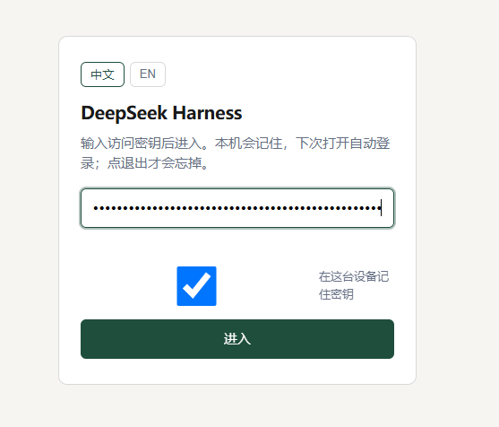
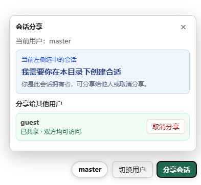

# dsh-simple-auth

[](https://dsh.pub/en/plugins/?q=lt9%2Fdsh-simple-auth)

Ultra-light login gate for [DeepSeek Harness](https://github.com/deepseek-ai/deepseek-harness) web.

Zero production dependencies. One login field. Optional **master / guest** keys. Sessions are isolated by default; only the **owner** can share or unshare; the sidebar list is **ACL-filtered**; a bottom-right **share FAB** targets the currently selected session.

Other catalog login gates cover passwords, TOTP, or settings cards. This one stays a shared-key (or per-user key file) gate plus session ACL. Do not stack it with `dsh-auth-gate`, `dsh-webui-auth`, `dsh-web-startup-auth`, or `dsh-auth-gateway`.

[中文说明](README.zh.md)

## Install

```bash
dsh plugin --profile web add github:lt9/dsh-simple-auth
```

If the profile is a pnpm workspace and add fails with `ERR_PNPM_ADDING_TO_ROOT`:

```bash
dsh plugin --profile web add -w github:lt9/dsh-simple-auth
```

Local checkout:

```bash
dsh plugin --profile web add ./dsh-simple-auth
```

Set the key **before** restarting dsh. The gate **fails closed**: if the key is missing, the login page explains that and every other request is denied.

```bash
export DSH_SIMPLE_AUTH_KEY='a-long-random-secret'
```

systemd / Docker: put the same variable in the service `Environment` / `EnvironmentFile`. To reuse an existing secret, point `keyEnv` at that variable instead of copying it:

```yaml
# $DSH_HOME/cordis.patch.yml  (home layer; replaces this plugin row's config)
- id: dsh-simple-auth
  config:
    keyEnv: EXISTING_SECRET_ENV
```

Restart the dsh web process, open the UI, enter the key.

`dsh --profile web --dump-config` should list a row named `dsh-simple-auth`.

## Screenshots

### Login

Visitors enter the access key once; optional “remember key on this device”.



### Session sharing (multi-user)

The share panel in the bottom-right targets the **currently selected sidebar session**. The owner can share with or revoke access for other users; guests can use the session but cannot manage sharing.



## Requirements

- Node.js ≥ 20
- dsh web profile (tested on `@deepseek-ai/dsh@0.1.1-rc.2` and `@deepseek-ai/dsh@0.1.2-rc.1`; both still expose `webServer.server`)
- `pnpm` on `PATH` if you use `dsh plugin add`

## What it protects

| Surface | Unauthenticated | Authenticated |
|---|---|---|
| Pages (`GET`/`HEAD`) | `302` → `/login` | passed through |
| APIs / other methods | `401` JSON | passed through |
| WebSocket upgrade | handshake `401` | passed through |
| Scripts | `Authorization: Bearer <key>` or `X-Api-Key` | same as a session |

`/login` and `/logout` are the only public paths.

## Configuration

All keys are optional. Defaults are applied in code (home-layer patch `config` **replaces** the whole object, it does not deep-merge).

| Key | Default | Meaning |
|---|---|---|
| `keyEnv` | `DSH_SIMPLE_AUTH_KEY` | Environment variable that holds the access key |
| `keyFile` | `""` | If set, read the key from this file (trimmed). Takes precedence over `keyEnv` |
| `cookieName` | `dsh_simple_auth` | Session cookie name |
| `sessionTtl` | `604800` | Cookie lifetime in seconds (7 days) |
| `cookieSecure` | `auto` | `auto` follows `X-Forwarded-Proto`; `true` / `false` force the `Secure` flag |
| `rewriteLoopback` | `true` | Present authenticated traffic as `127.0.0.1:<port>` so dsh’s reverse-proxy Host fence does not 403 privileged APIs |
| `title` | `DeepSeek Harness` | Login heading |
| `hint` | (built-in zh/en copy) | Login subtitle |
| `remember` | `true` | Show “remember key on this device” (localStorage only; the server still uses the cookie) |
| `rpcMinTimeoutMs` | `120000` | Floor for `AbortSignal.timeout` injected into the web index. dsh’s unary RPC default is 30s; large `session.history` pages over a tunnel abort with `The user aborted a request`. `0` disables the inject |

Never put the key itself in YAML or git.

## Multi-user session sharing (0.2+)

When `usersFile` is set, each login key maps to a user `id` + `name`. Cookies sign `userId` with a separate `secret` file. Sessions are isolated by default; the **current session** is the `sessionId` from DSH RPC (`session.history` / `session.prompt`, etc.), and titles come from official `session.list`. Owners can share that session. Shared users get mutual access but cannot share or unshare. Concurrent `session.prompt` / `session.updateQueue` on one session returns `409 session-busy`.

```json
[
  { "id": "master", "name": "master", "keyEnv": "DSH_SIMPLE_AUTH_KEY" },
  { "id": "guest", "name": "guest", "keyFile": "/path/to/guest-key" }
]
```

| Key | Default | Meaning |
|---|---|---|
| `usersFile` | `""` | JSON user list; enables multi-user when valid |
| `aclFile` | `$DSH_HOME/simple-auth/acl.json` | Session owner / sharedWith |
| `secretFile` | `$DSH_HOME/simple-auth/secret` | Cookie HMAC secret (auto-created) |
| `legacyOwner` | `master` | Owner for pre-existing sessions on upgrade |

## Known limitations

- Sharing a session shares the live agent, not chat text only. Credentials, bash, workspace, and settings remain machine-wide.
- This is access control, not a substitute for TLS or treating the agent as remote code execution.
- Catalog listing (when present) is not a security audit.

## Disable / uninstall

```bash
dsh plugin --profile web remove dsh-simple-auth
```

Then restart the dsh web process. To disable without uninstalling, stop setting `usersFile` / `keyEnv` / `keyFile` — the gate fails closed.

## Security notes

- Fail-closed: misconfiguration does not leave the UI open.
- Login attempts are rate-limited per client IP (honors `X-Forwarded-For` only when the peer is loopback).
- Sessions are HMAC-signed with the access key (stateless). Rotating the key invalidates every cookie.
- Authenticated JSON `/api` responses that look like `session.history` pages drop `assistant/chunk` events whose message already closed ([dsh #4678](https://github.com/deepseek-ai/deepseek-harness/discussions/4678)) so the browser does not download tens of megabytes of redundant deltas.
- Do not expose dsh over plaintext on the public internet; use HTTPS and keep `cookieSecure: auto`.
- Behind a tunnel, also pass the public origin to dsh: `--trusted-host your.example:port` (repeatable). This plugin already rewrites `Host`/`Origin` to loopback after login; the CLI flag is the documented backup for the `/api` fence.

## Development

```bash
node --test
```

Zero production dependencies. The host half wraps `webServer.server` `request` / `upgrade` listeners (the same approach used by other dsh auth gates) so static files, `/api`, and sockets are covered even on builds that have no request-gate extension point. On 0.1.2 the web surface also has a browser-session cookie (`connection.authorizeIndex`); after our login cookie is valid, this plugin skips that second 401 so the SPA still loads without the process launch token. 0.1.1 has no such fence and is unchanged.

## License

MIT
